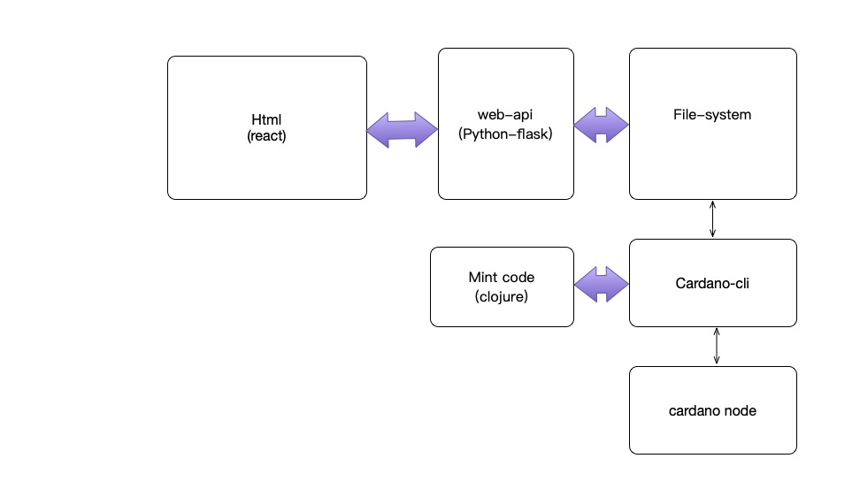
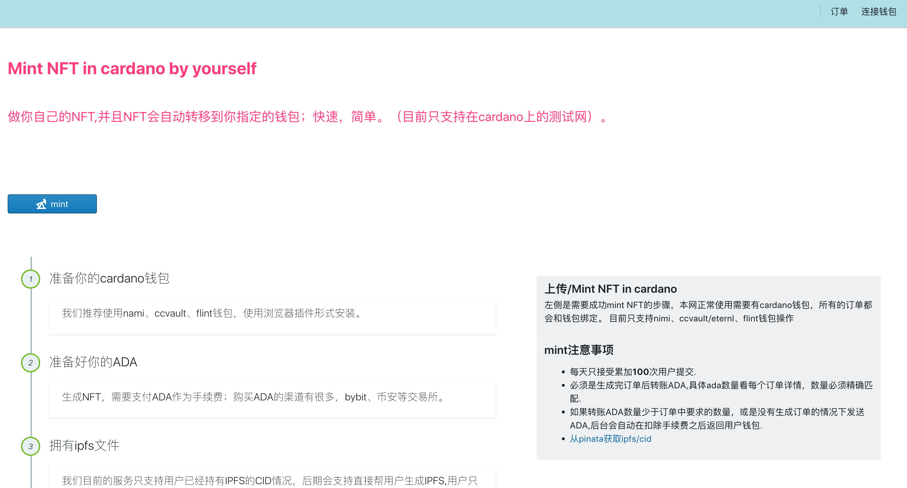

# cardano-mint-web-index

这次开源是的代码是疫情期间在上海封闭在家抽空写的，苦中作乐，还好没有饿着肚子写代码。大致介绍下，主要的功能是在线mint nft 。总结下技术框架，后台定时mint任务是用clojure（可以用java调用，打包后是jar文件）调用cardano-cli命令来执行与cardano node 的通讯，那么也就是意味着你需要跑一个cardano node服务，这个好处是你可以立马获取cardano链上数数据。 前端是用react写的，一辈子没写过react,花了几天学习后就动手开始写的，难免写得不是很成熟合理。后端web是用python的flask写的，只想快速对接前端接口，python开发比较容易。python的服务存储数据没有使用数据库，不想写那么重，前端每次提交的mint信息保存的文件目录下，每个提交需要mint的address自动生成一个目录，为后续cardano-cli操作的后续文件做存储用。

### 项目

1.前端 ：web-asset-mint

2.web接口：api-asset-mint

3.定时任务：task-asset-mint

## 环境准备：

1.jdk-8以上

2.python-2.7

3.gunicorn 

4.cardano node server

具体安装不详细说明了。

### 前端截图

